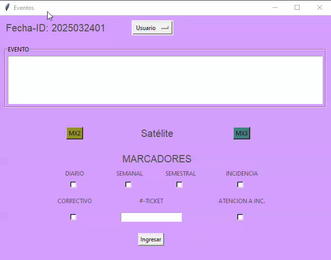
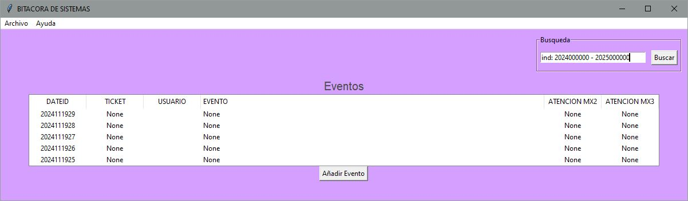

# Application to keep a record of problems and solutions in IT area of a Satellite Control Center

This application was born because of the need to keep a compendium of the problems in the Satellite Control Center.

* The application has the capability to show the last five problems and solutions in a table in the main window named "Bitacora de Sistemas".
* There is a blank space with the title "Busqueda" to introduce text that it will search in a database to return information about it. 
* Also the user can find a button with the name "Añadir Evento". The action of the button is to open another window where the user can register a new event.
* A bar menu where the user can find the section "Archivo" with the function "Indicadores".

## Event_window

The window "Eventos" is where the user can register important information in fields that will be introduced in a database.
The fields that the user will need fill are:

* The user who is introducing the event. They are "Coordinador" "Analista" or "Invitado".
* A description of the event.
* One of two buttons must be pressed to mark if the event is for mx2 or mx3 satellite.
* There are some checkbuttons with its appropriate label. They are "Diario", "Semanal", "Semestral", "Incidencia", "Correctivo" and "Atención a incidencia".
* Finally in the middle of those checkbuttons there is a field named #-Ticket. This is just in the case the user needs to assign a number of ticket for that problem and it needs a follow-up.

*It is worth mentioning that some fields are mandatory, so the user will can not introduce the event until all the fields are filled.*

## Trace_window

This is a window that the user can open clicking in a line of one event introduced to the application in the main window. The purpose of this window named "Seguimiento" is the user can visualize the last actions made for one problem. For instance, the #-Ticket and all the description in the line where the user clicked. Obviously the user can add new information to update the problem or even the solution. 

To update one event, the user needs to fill some fields:

* The user who is updating the event.
* The update of the problem with the actions taken by the user to solucion it.
* Finally there are two checkbuttons with the options "Correctivo" and "Atención a incidencia" just if the user needs to mark the type of the update.

## Export data to an excel file

With the function "Indicadores" that is in "Archivo" in the bar menu. The user can export a table with all the events and their marks in an excel file.

## Search function

To use this function is so easy: just write a word in the *blank entry* and make a search. The next image is an example of the search "test".

## Hidden function

There is a hidden function in the search bar. The user could need the information about this hidden function. That information is in the bar menu of the main window in the section "Ayuda..." and "Info. Indicadores".

For example. If the user wants export all the events in the year 2024 in a excel file. The format to make that exportation is the following.

And the results are an excel file with only the events registered in the year 2024.

