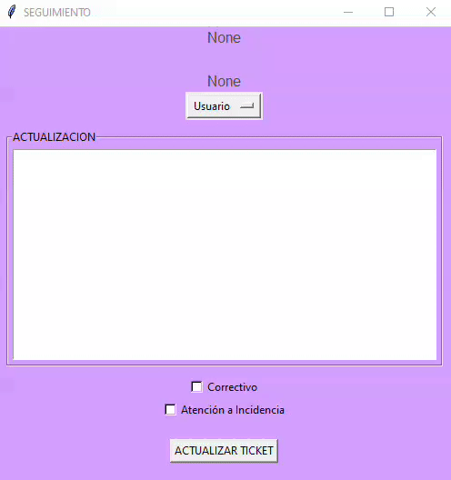

# Application to keep a record of troubles and solves in IT area of a Satellite Control Center

This application born since the need to keep a compendium of the troubles in the Satellite Control Center.

* The application has the capability to show the last five troubles and solutions with a table in the main window named "Bitacora de Sistemas".
* There is a function with the title "Busqueda". It is a blank space to introduce text that it will be search in a database to return information about it. 
* Also the user can find a button with the name "Añadir Evento". The action of the button is open another window where the user can register a new event.

## Event_window

The window "Eventos" is where the user can register some important fields to be introduce it to a database.
Some important fields that the user will need fill are:

* The user who is introducing the event. They are "Coordinador" "Analista" or "Invitado".
* A description of the event.
* One of two buttons must be press to mark if the event is for mx2 or mx3 satellite.
* There are some checkbuttons with its appropriate label. They are "Diario", "Semanal", "Semestral", "Incidencia", "Correctivo" and "Atención a incidencia".
* Finally in the middle of those checkbuttons there is another field named #-Ticket. This is just for the case if the user needs to assign a number of ticket if that trouble will need follow-up.

*It is worth mentioning that some fields are mandatory, so the user will can not introduce the event until all the fields be fill.*

## Trace_window

This is a window that the user can open clicking in some of one events introduced to the application. The porpuse of this window named "Seguimiento" is that the user can visualize the last actions made for one trouble. For instance, the #-Ticket if it has and all the description in the line where the user clicked. Obviously the user can update the event with new information. 

For update one event, the user needs to fill some fields that are mandatory.
The fields in this window are:

* The user who is updating the event. This is a mandatory.
* The update of the problem with the actions taken by the user to resolve it. This is a mandatory field too.
* Finally there are two checkbuttons with the options "Correctivo" and "Atención a incidencia" just if the user needs to mark the type of the update.

